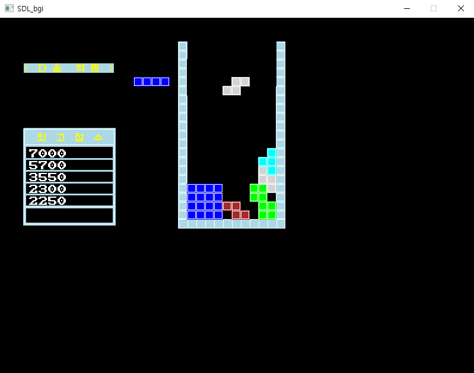
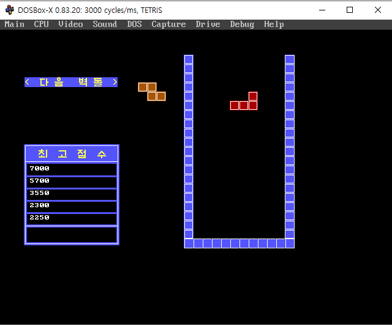

# sdl_bgi
windows / dos cross platform BGI(Borand Graphics Interface) development system

## BUILD
* visual studio 2019 or higher
* vcpkg
```
git clone https://github.com/microsoft/vcpkg
bootstrap-vcpkg.bat
vcpkg install sdl2
vcpkg integrate install
```

* in release tab, download DOSBOX-X.rar. and extract to project folder.

### dos result



### win32 result


